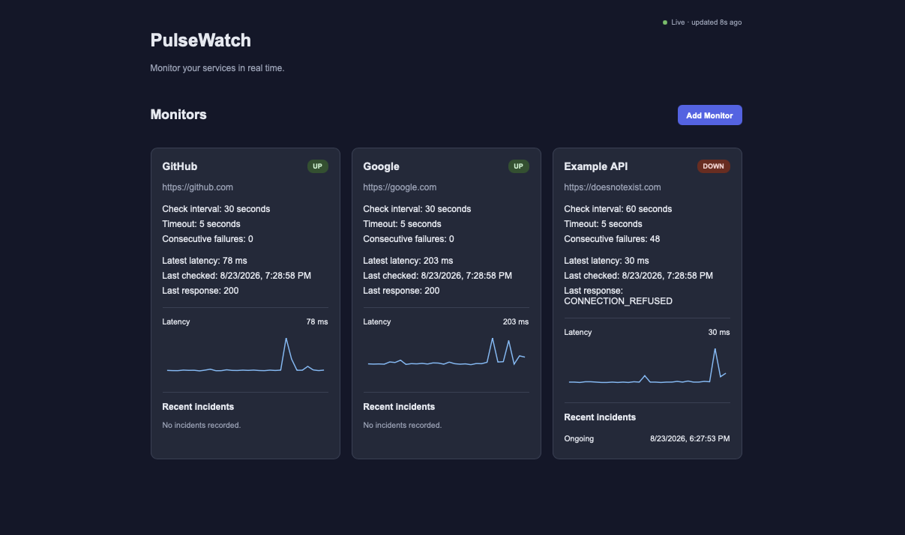
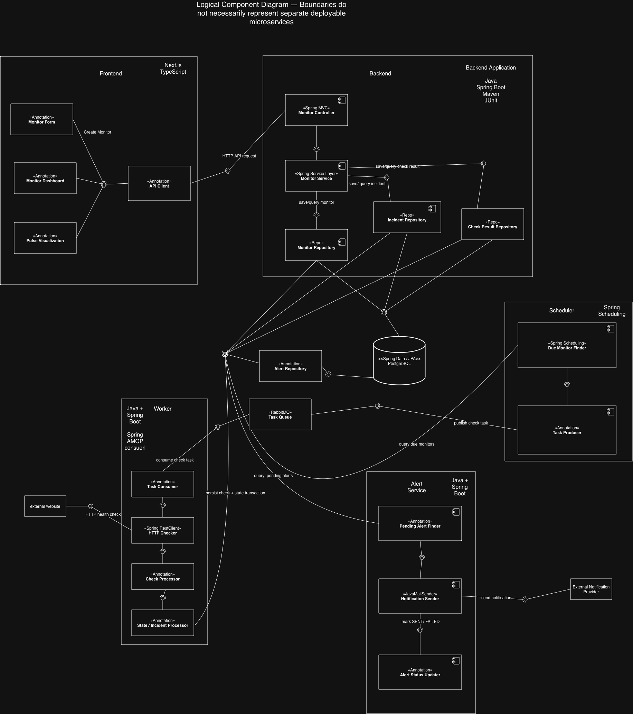
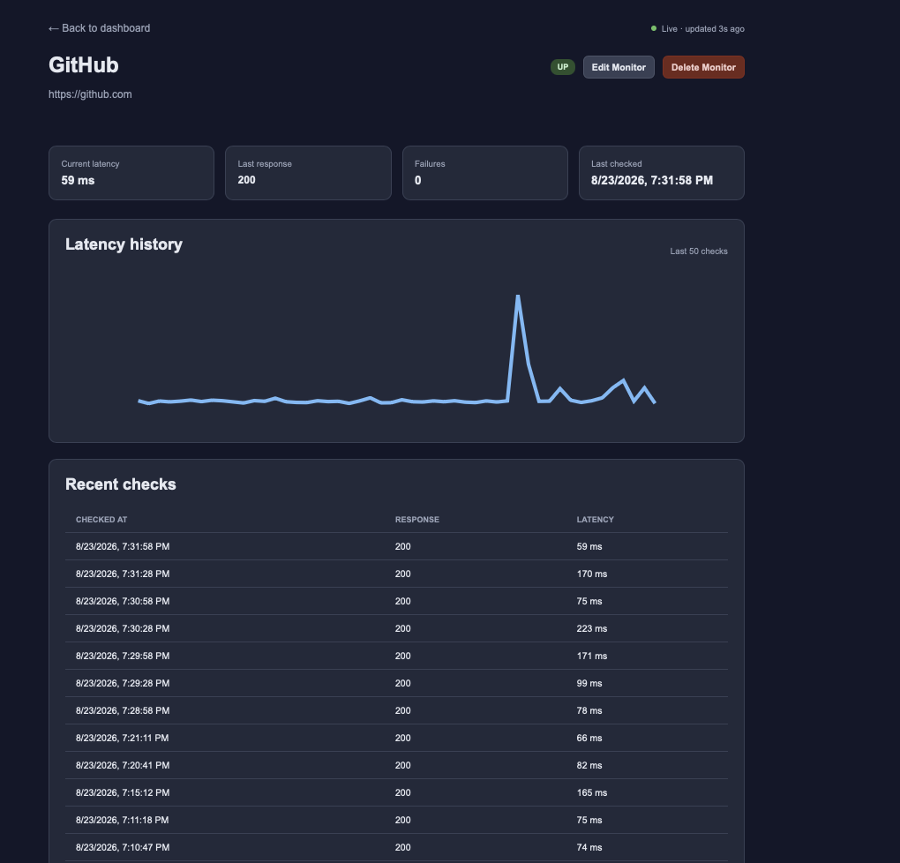
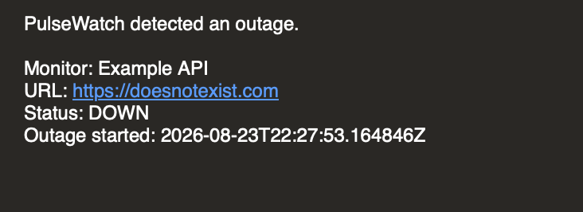
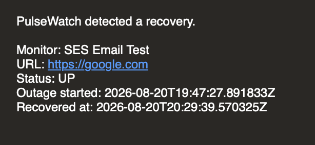

# PulseWatch

A distributed uptime-monitoring platform that checks websites and APIs, tracks latency and outages, and sends outage and recovery notifications.



## Overview

PulseWatch monitors websites and APIs to answer three questions:

- **Is the service available?** Monitors transition through `PENDING`, `UP`, `DEGRADED`, and `DOWN`.
- **How quickly is it responding?** Each health check records response latency.
- **When did outages occur?** Consecutive failures create incidents that are resolved when the service recovers.

Users create monitors through a Next.js dashboard. A Spring Boot scheduler identifies due checks and publishes tasks to RabbitMQ. Workers perform HTTP checks, persist results to PostgreSQL, update monitor state, create and resolve incidents, and trigger outage or recovery notifications through Amazon SES.

---

## Features

- Create, edit, and delete uptime monitors
- Scheduled HTTP health checks
- Response latency tracking
- HTTP and network-error classification
- `PENDING`, `UP`, `DEGRADED`, and `DOWN` monitor states
- Consecutive-failure outage detection
- Historical check results
- Automatic incident creation and recovery
- Amazon SES outage and recovery email alerts
- Live dashboard polling
- Latency history visualization
- Incident history
- Dockerized development environment
- Playwright end-to-end testing
- GitHub Actions continuous integration
- Checkstyle and SpotBugs static analysis

---

## Architecture



### Request and Monitoring Flow

```text
                     ┌─────────────────┐
                     │     Next.js     │
                     │    Frontend     │
                     └────────┬────────┘
                              │
                              ▼
                     ┌─────────────────┐
                     │   Spring Boot   │
                     │   Backend API   │
                     └────────┬────────┘
                              │
                              ▼
                     ┌─────────────────┐
                     │   PostgreSQL    │
                     └─────────────────┘


                     ┌─────────────────┐
                     │    Scheduler    │
                     └────────┬────────┘
                              │
                              ▼
                     ┌─────────────────┐
                     │    RabbitMQ     │
                     └────────┬────────┘
                              │
                              ▼
                     ┌─────────────────┐
                     │     Worker      │
                     └────────┬────────┘
                              │
                              ▼
                     ┌─────────────────┐
                     │ Target Website  │
                     │     or API      │
                     └────────┬────────┘
                              │
                              ▼
                         CheckResult
                              │
                              ▼
                  Monitor / Incident / Alert


                         Alert Record
                              │
                              ▼
                     ┌─────────────────┐
                     │   Amazon SES    │
                     └────────┬────────┘
                              │
                              ▼
                            Email
```

### Component Responsibilities

**Frontend**
- Displays monitors and their current status
- Provides monitor CRUD operations
- Displays latency history and incidents
- Periodically refreshes monitoring data

**Backend API**
- Handles monitor CRUD requests
- Validates monitor configuration
- Exposes check and incident history
- Coordinates persistence and application logic

**Scheduler**
- Finds monitors whose next check is due
- Creates monitoring tasks
- Publishes tasks to RabbitMQ

**RabbitMQ**
- Decouples scheduling from HTTP checks
- Buffers monitoring tasks for workers

**Worker**
- Consumes monitoring tasks
- Sends HTTP requests to target services
- Measures latency
- Classifies HTTP and network failures
- Stores check results
- Updates monitor state
- Creates and resolves incidents

**PostgreSQL**
- Stores monitor configuration
- Stores historical check results
- Stores incidents and alert state

**Amazon SES**
- Delivers outage and recovery email notifications

---

## How It Works

### 1. Monitor Creation

A user creates a monitor with information such as:

```text
Name
URL
Check interval
Request timeout
```

New monitors begin in the `PENDING` state.

The first health check waits until the monitor's scheduled check time instead of running immediately.

---

### 2. Scheduling

The scheduler periodically searches for monitors where:

```text
nextCheckAt <= currentTime
```

For every due monitor, it creates a task containing the information needed by a worker and publishes that task to RabbitMQ.

The scheduler itself does not perform HTTP requests.

```text
Monitor
   ↓
Scheduler
   ↓
RabbitMQ
```

---

### 3. Worker Processing

A worker consumes the task from RabbitMQ and performs the HTTP request.

```text
RabbitMQ
   ↓
Worker
   ↓
Target Website/API
```

The worker records information such as:

```text
Checked time
HTTP status code
Latency
Network error
```

The result is persisted as a `CheckResult`.

---

### 4. Health State

PulseWatch uses consecutive failures to avoid declaring an outage after a single temporary error.

```text
Successful check
      ↓
Reset consecutive failures
      ↓
UP
```

A failed check below the outage threshold produces:

```text
Failed check
      ↓
Increment failure count
      ↓
DEGRADED
```

Once the failure threshold is reached:

```text
Failed check
      ↓
Threshold reached
      ↓
DOWN
      ↓
Create Incident
      ↓
Create OUTAGE alert
```

The current MVP uses three consecutive failures before transitioning a monitor to `DOWN`.

---

### 5. Recovery

When a monitor that is currently down succeeds again:

```text
Successful check
      ↓
Reset failure count
      ↓
UP
      ↓
Resolve open Incident
      ↓
Create RECOVERY alert
```

A continuous outage is represented by one incident instead of creating a new incident for every failed check.

---

### 6. Alert Delivery

Outage and recovery alerts are persisted before notification delivery.

```text
Incident state change
       ↓
Create Alert
       ↓
Amazon SES
       ↓
Email
```

This keeps monitor health state separate from notification delivery.

For example, an email delivery problem does not change whether the monitored service is considered `UP` or `DOWN`.

---

## Monitor Details



Each monitor provides:

- Current health state
- Latest HTTP response
- Latest latency
- Consecutive failure count
- Recent health checks
- Latency history
- Incident history
- Edit and delete controls

---

## Alerting

PulseWatch sends outage and recovery notifications through Amazon SES.

### Outage Notification



### Recovery Notification



---

## Tech Stack

### Backend

- Java 21
- Spring Boot
- Spring Data JPA
- Maven

### Frontend

- Next.js
- React
- TypeScript
- Playwright

### Data and Messaging

- PostgreSQL
- RabbitMQ

### Cloud and DevOps

- Amazon SES
- Docker
- Docker Compose
- GitHub Actions
- Checkstyle
- SpotBugs

---

## Data Model

PulseWatch separates current monitor state from historical checks and outage incidents.

```text
Monitor
   │
   ├───────────────┐
   │               │
   ▼               ▼
CheckResult      Incident
                    │
                    ▼
                   Alert
```

### Monitor

Represents a website or API being monitored.

Important fields include:

```text
id
name
url
checkIntervalSeconds
timeoutSeconds
nextCheckAt
status
consecutiveFailureCount
```

### CheckResult

Represents one HTTP monitoring attempt.

```text
id
taskId
monitorId
checkedAt
statusCode
latencyMs
error
```

### Incident

Represents a continuous outage.

```text
id
monitorId
startedAt
endedAt
```

An incident with:

```text
endedAt = NULL
```

is still active.

### Alert

Represents a notification associated with an outage or recovery.

Alert types:

```text
OUTAGE
RECOVERY
```

Delivery states:

```text
PENDING
SENT
FAILED
```

---

## API

### Monitor Management

```http
POST   /monitors
GET    /monitors
GET    /monitors/{id}
PATCH  /monitors/{id}
DELETE /monitors/{id}
```

### Monitoring History

```http
GET /monitors/{id}/checks?limit=50
GET /monitors/{id}/incidents?limit=10
```

Example:

```bash
curl http://localhost:8080/monitors
```

---

## Local Development

### Prerequisites

Install:

- Docker Desktop
- Docker Compose
- Java 21
- Maven
- Node.js
- npm

---

### 1. Clone the Repository

```bash
git clone https://github.com/chill-one/Pulse-Watch.git
cd Pulse-Watch
```

---

### 2. Configure Environment Variables

Create your local environment file:

```bash
cp .env.example .env
```

Configure the required values:

```env
POSTGRES_PASSWORD=your_password

RABBITMQ_USER=pulsewatch
RABBITMQ_PASSWORD=your_password

AWS_REGION=us-east-1

AWS_ACCESS_KEY_ID=your_access_key
AWS_SECRET_ACCESS_KEY=your_secret_key

PULSEWATCH_EMAIL_FROM=your-verified-email@example.com
PULSEWATCH_EMAIL_TO=your-email@example.com
```

Keep `.env` private and never commit credentials to Git.

Amazon SES requires a verified sending identity before real email notifications can be delivered.

---

### 3. Start Backend Services

From the repository root:

```bash
docker compose up -d --build backend
```

Docker Compose starts the backend along with its PostgreSQL and RabbitMQ dependencies.

View backend logs:

```bash
docker compose logs -f backend
```

Verify that the API is running:

```bash
curl http://localhost:8080/monitors
```

A fresh database may return:

```json
[]
```

---

### 4. Start the Worker

Start the monitoring worker:

```bash
docker compose up -d --build worker
```

View worker logs:

```bash
docker compose logs -f worker
```

---

### 5. Start the Frontend

For local frontend development:

```bash
cd frontend
npm ci
npm run dev
```

Open:

```text
http://localhost:3000
```

When the frontend runs directly on the host, it connects to the backend at:

```text
http://localhost:8080
```

When running inside Docker, the frontend should use the Compose backend service hostname:

```text
http://backend:8080
```

---

### 6. Stop Services

Stop running containers:

```bash
docker compose down
```

Avoid:

```bash
docker compose down -v
```

unless you intentionally want to delete PostgreSQL and RabbitMQ volumes and reset local data.

---

## Testing

### Backend

From the repository root:

```bash
mvn verify
```

The backend pipeline includes Java tests and configured quality checks.

Individual static-analysis checks can also be run separately.

Checkstyle:

```bash
mvn checkstyle:check
```

SpotBugs:

```bash
mvn -Dcheckstyle.skip compile spotbugs:check
```

---

### Frontend

From the `frontend` directory:

```bash
npm ci
npm run lint
npm run build
```

---

### End-to-End Tests

PulseWatch uses Playwright for browser-level end-to-end testing.

Make sure the backend is running on port `8080`, then from `frontend` run:

```bash
npm run test:e2e
```

The current E2E suite includes:

- A dashboard smoke test
- A full monitor CRUD workflow

The CRUD test exercises:

```text
Open Dashboard
      ↓
Create Monitor
      ↓
View Monitor
      ↓
Edit Monitor
      ↓
Verify Updated Monitor
      ↓
Delete Monitor
      ↓
Verify Removal
```

The E2E tests use the real Spring Boot backend and database rather than mocking API requests.

They intentionally avoid asserting asynchronous health-state changes because scheduler and worker processing occurs independently of the browser interaction.

---

## Continuous Integration

GitHub Actions automatically validates the project on pushes and pull requests.

The CI pipeline includes:

```text
                     Checkstyle
                         │
          ┌──────────────┼──────────────┐
          │              │              │
          ▼              ▼              ▼
     Java Tests       SpotBugs    Docker Compose
                                         
                         │
                         ▼
                  Frontend ESLint
                         │
                         ▼
                   Frontend Build
                         │
                         ▼
                    Playwright E2E
```

The Playwright CI environment starts:

```text
PostgreSQL
RabbitMQ
Spring Boot Backend
Next.js Frontend
Chromium
```

before exercising the application through the browser.

This provides coverage across the frontend, API, database, and supporting infrastructure.

---

## Engineering Decisions

### Why RabbitMQ?

HTTP monitoring work can be slow or temporarily blocked by network conditions.

The scheduler should remain focused on deciding **when** checks should run rather than performing the checks itself.

PulseWatch therefore separates:

```text
Scheduling
    ↓
Queueing
    ↓
Execution
```

using:

```text
Scheduler → RabbitMQ → Worker
```

This reduces coupling between scheduling and network execution.

---

### Why Separate `Monitor` and `CheckResult`?

A `CheckResult` represents one observation.

```text
"This HTTP request failed."
```

A monitor's status represents PulseWatch's current interpretation of multiple observations.

For example:

```text
1st failure
CheckResult = failed
Monitor = DEGRADED
```

versus:

```text
3rd consecutive failure
CheckResult = failed
Monitor = DOWN
```

Keeping these concepts separate preserves monitoring history while allowing state transitions to use multiple checks.

---

### Why Incidents?

Several failed checks may belong to the same outage.

Without incidents:

```text
Failure
Failure
Failure
Failure
```

could appear as four unrelated outage events.

Instead:

```text
Outage starts
     ↓
Repeated failures
     ↓
Service recovers
```

is represented as one Incident with a start and end time.

---

### Why Separate Alert Delivery?

Monitoring state and email delivery solve different problems.

PulseWatch first records the monitoring event and alert state before attempting email delivery.

```text
Monitor state change
       ↓
Incident
       ↓
Alert
       ↓
Amazon SES
```

A notification failure should not change whether the target service is considered healthy.

---

### Why Polling Instead of WebSockets?

The MVP periodically refreshes dashboard data.

Monitoring updates are relatively infrequent, so polling keeps the initial implementation simple without introducing persistent connection management.

Possible future alternatives include:

- Server-Sent Events
- WebSockets

---

## Monitor States

PulseWatch currently uses four monitor states.

### `PENDING`

The monitor has been created but its first scheduled health check has not completed.

### `UP`

The latest health evaluation indicates the target is available.

### `DEGRADED`

One or more checks have failed, but the consecutive-failure threshold has not been reached.

### `DOWN`

The failure threshold has been reached and an outage incident is active.

Typical transition:

```text
PENDING
   ↓
  UP
   ↓
DEGRADED
   ↓
 DOWN
   ↓
  UP
```

---

## Reliability Considerations

PulseWatch's architecture is designed around several reliability concepts:

- Scheduled checks are separated from network execution
- RabbitMQ buffers monitoring work
- Request timeouts prevent checks from waiting indefinitely
- Network errors are recorded separately from HTTP responses
- Consecutive failures reduce false outage detection
- Check history is stored separately from current monitor state
- Incidents represent continuous outages
- Alert delivery is separated from monitor health state
- Related state changes use database transactions

---

## Project Status

### MVP Complete

PulseWatch currently supports the complete monitoring lifecycle:

```text
Create Monitor
      ↓
Schedule Check
      ↓
Publish Task
      ↓
Worker Checks Service
      ↓
Store CheckResult
      ↓
Update Health State
      ↓
Detect Outage
      ↓
Create Incident
      ↓
Send Alert
      ↓
Display Monitoring Data
```

---

## Roadmap

Potential post-MVP improvements include:

- Load and performance testing
- Cloud deployment
- Terraform infrastructure
- Database migrations
- Authentication and user ownership
- Server-Sent Events for live updates
- Public status pages
- Additional notification channels
- Alert retry and deduplication
- Distributed scheduler coordination
- Rate limiting
- Per-domain throttling
- Data-retention policies
- Metrics and observability

---

## Design Documentation

Additional project design material is available in the [`design`](../design/) directory, including:

- System architecture diagrams
- Component diagrams
- Class diagrams
- User-flow diagrams
- Design notes
- Technology decision documentation

---

## License

This project was built for educational and portfolio purposes.
